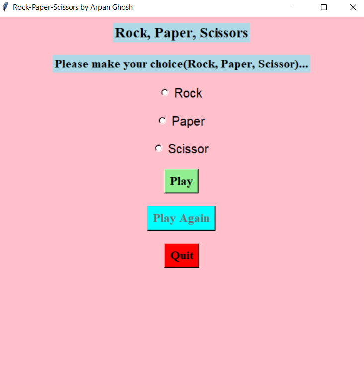
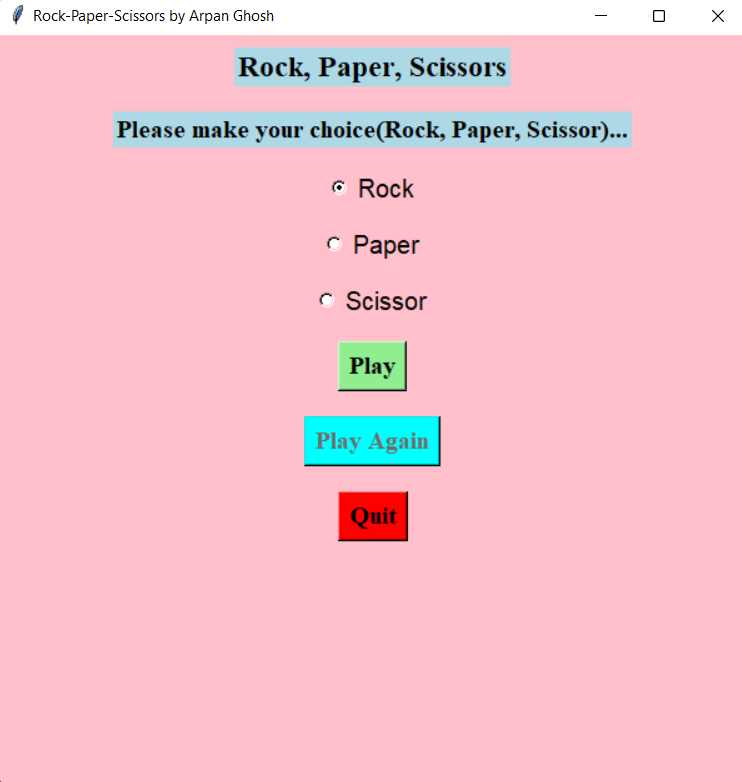
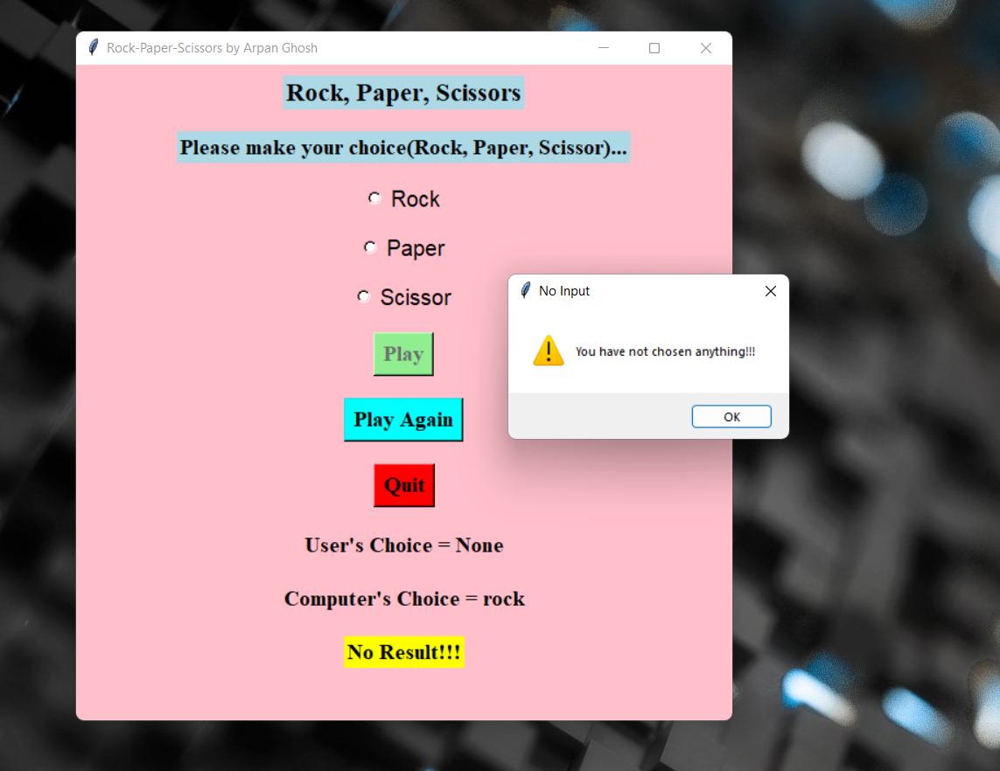
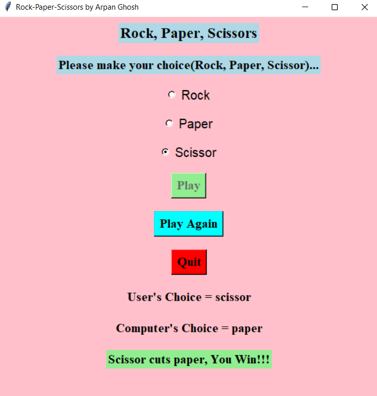

# GUI-Rock-Paper-Scissors-game-using-Tkinter-Python
<strong><ins>A simple GUI Rock, Paper, Scissors game made using Tkinter(Python) by Arpan Ghosh</ins></strong>.  
<b> The GUI Screen of the game</b>  
  
<b><ins>Instructions to play this game:-</ins></b> 
<b>1) </b>The user has to first choose from Rock/Paper/Scissor by clicking the Radiobutton in front of the respective labels. Next the user has to click on the <b>"Play"</b> button inorder to play the game.The <b>"Play Again"</b> button will remain grayed-out during this stage.  
  
<b>2) </b>If the user directly tries to click on <b>Play</b> before or without making any choice, then a dialog box will pop up saying that the user has not chosen any option.  
  
<b>So inorder to get an outcome(Win/Loss/Tie) it is mandatory for the user to select a choice and only then proceed to click "Play".</b>  
<b>3)</b>If the user chooses an option and clicks on <b>Play</b> the outcome of the game is displayed.  
  
<b>The outcome of the game is decided based on the choice of the user and the <ins>randomly</ins> generated choice by the Computer.</b>  
After the outcome of the game is shown, the user can play another match by clicking the <b>Play Again</b> button.On doing this, the <b>Play</b> button moves from the grayed-out state to the active state and the game can be played again.This same process can be repeated multiple times and the game can be played as many number of times as the user desires.  
The user can exit/close the game by clicking the <b>Quit</b> button.

